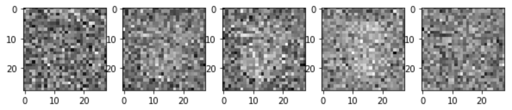
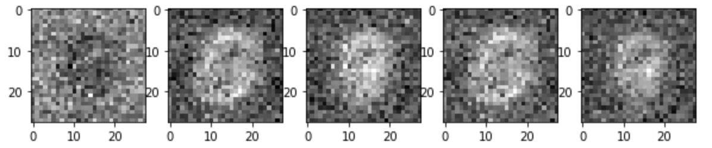
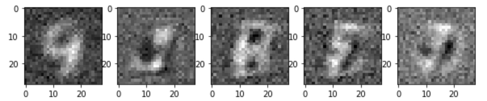

# Vanilla GAN

A pytorch implementation of Vanilla GAN using MNIST digits data ([https://papers.nips.cc/paper/5423-generative-adversarial-nets.pdf](https://papers.nips.cc/paper/5423-generative-adversarial-nets.pdf))

실험 결과와 코드는 [https://github.com/EmjayAhn/GAN-pytorch](https://github.com/EmjayAhn/GAN-pytorch) 에서 확인 할 수 있습니다.

## 0. 목표

GAN 은 최근 인기를 끌고 있는 generative model 중 하나입니다. 다양한 모델이 쏟아져 나오고 있기에, 이 트렌트를 따라가기 위해서, 가장 기본적인 vanilla gan 을 구현하고, 이해하는 것이 목표입니다. 이번 예제에서는 MNIST digit 을 사용하였으나, 이미지 외에도 다양한 데이터를 활용할 수 있습니다.

## 1. Model 구조

GAN 의 아버지 Ian Goodfellow가 제안한 이 모델은 두가지 신경망으로 구성 되어 있습니다. 먼저, 우리가 가지고 있는 데이터와 비슷하게 데이터를 생성하는 것을 학습하는 **Generator** 와 Generator 가 생성한 데이터(fake)와 실제 우리가 가지고 있는 데이터(real)를 fake 인지 real 인지 구분하는 **Discriminator** 를 구분하는 두 신경망으로 구성되어 있습니다. 

### 1-1. Generator

- Generator 는 Gaussian Random Noise (mean=0, std=1) 를 입력으로 받아, 이 noise로 부터 data 를 생성해냅니다.
- 이번 구현에서 Generator는 다음과 같이 작성하였습니다.

- Dense layer 만 사용했으며, gradient vanishing 현상을 막기 위해 activation 을 거친 후, Batch Normalization 을 추가하였습니다.

### 1-2. Discriminator

- Discriminator 는 Generator 가 생성해낸 데이터와 기존에 가지고 있는 진짜 데이터를 입력으로 받아, 진짜 데이터를 1, 가짜데이터를 0으로 학습하는 classifier 입니다.
- 아래의 Loss Function 을 확인 하겠지만, 진짜 데이터에 대해서는 그 확률 값을 높게 하고, 가짜데이터에서는 그 확률 값을 0에 가깝게 하는 것이 이 모델의 optimize 목표입니다.
- 이번 구현에서 Discriminator를 다음과 같이 작성하였습니다.

## 2. Loss Function

### 2-1. Loss Function 의 해석

$$\underset{G}{\text{min}}\underset{D}{\text{max}}V(D, G)=E_{x~p_{data(x)}}[logD(x)]+E_{z~p_{z}(z)}[log(1-D(G(z)))]$$

Vanilla GAN 의 Loss function 은 위와 같습니다. Loss Function 의 구조 자체는 min-max 최적화로써, Discriminator와 Generator 의 loss 함수를 각각 최적화 해 나아가면서 위 식의 균형 향해 다가가는 것입니다.

- 먼저, Discriminator에 대한 max 부터 살펴 보면, Real을 입력으로 넣었을 때는, log(D(x))의 기댓값이 최대가 되게 하고, G(z) 즉, 가짜를 가짜라고 할 확률 1-D(G(z))는 최대가 되게끔 학습을 하는 것입니다.
- Generator 에 대한 min 을 살펴보면, G(z) 는 가우시안 랜덤 변수를 받아 생성된 데이터를 D(G(z)), discriminator에 넣었을 때, 1-D(G(z)), 즉 가짜라고 할 확률을 최소화하게끔 학습하는 것입니다. 이는 결국, Discriminator를 속이기 위해 generator의 최적화가 실행된다는 의미입니다.

이 식에서 중요한 점은, Discriminator 는 학습할 때, Generator 가 생성한 데이터와 진짜 데이터 모두를 보며 학습하지만, Generator 는 그 어디에서도 진짜 데이터가 어떻게 생겼는지는 확인하지 않습니다. 오로지 Discriminator 를 속이기 위해 학습하는 것이지만, 그 결과 우리가 가지고 있는 진짜 데이터와 비슷하게 만들수 있는 모델을 획득하게 될 수 있는 것이라는 점에서 매우 획기적인 모델입니다.

### 2-2. 실제 구현에서의 변형

Generator 에 대한 loss function 은 log(1-(D(G(z)))를 최소화 하는 것입니다. 하지만, log(1-x) 형태의 식은 x가 0일 때, 그 gradient 가 매우 작아, 학습이 매우 오래 걸리는 문제가 있습니다. 이를 해결하기 위해, log(1-D(G(z)))를 G에 대해 최소화 하는 것은 결국, -log(D(G(z)))를 최소화 하는 것과 같고, 이는 log(D(G(z)))를 최대화 하는 것과 같습니다. 따라서 실제 구현에서의 criterion 은 Discriminator 가 사용하는 criterion(여기선, binary cross enntropy loss)을 동일하게 사용합니다.

## 3. 학습 및 모델 결과

학습 parameter 는 다음과 같습니다.

- Total epoch: 300
- batch size : 128
- z dimension : 100
- Adam optimizer : lr=0.0002, weight_decay=8e-9

다음은 generator가 학습이 되가면서, 같은 가우시안 랜덤 노이즈에 대해 mnist 와 닮은 데이터를 생성해 나가는 과정입니다.

(1) 0 epoch

약 400개의 배치를 학습한 후, 찍은 사진이기에 가운데에 아주 미세한 형태는 보이지만, 가우시안 노이즈임을 확인 할 수 있습니다.

(2) 20 epoch

20 epoch 만 되더라도, ~~(마치 뱃속의 아가처럼(?))~~ 가운데에 어떤 형태가 생성되기 시작하는 것을 확인 할 수 있습니다. 

(3) 100 epoch

9, 3, 8, (horizontal flipped) 3, 1.. 아주 힘들게 MNIST 와 비슷해 보이는 숫자를 확인 할 수 있습니다.

## 4. 결론

이번 구현의 목표는 나의 첫 vanilla gan 을 논문과 여러 자료를 공부해보며, 구현해 보는 것에 있었기에, 이를 완수하고, 실제로 학습 시켰을 때, generator 로써 기능을 할 수 있다는 점에서 유의미 하였습니다. 다양한 repository 에서 서로 다른 framework 를 사용하여, gan 을 구현하는 것을 참조 할 수 있습니다. 하지만, 직접 공부해보고, loss function의 의미를 해석하여 직접 구현해보며 많은 것을 배울 수 있었습니다. 실제로 loss function 위 처럼 바꾸지 않았을 때는 1000 epoch 를 학습하더라도 generator가 학습 되지 않는 실패 경험을 통해, 자세한 논문 리딩과 분석은 구현에 있어 필수적임을 느낄 수 있었습니다.

## 5.  Futher Study

자원의 제약으로 작은 모델 구조와 hyper parameter tuning을 더 하지 못한게 아쉽습니다. generator 가 생성해내는 모양이 조금더 세밀하게 할 수 있는 것을 더 해보고 싶고, MNIST 데이터 뿐만아니라 본 논문의 참조사진처럼 CIFAR10 이나, TFD 데이터에 대해서도 실험해보고 싶습니다.